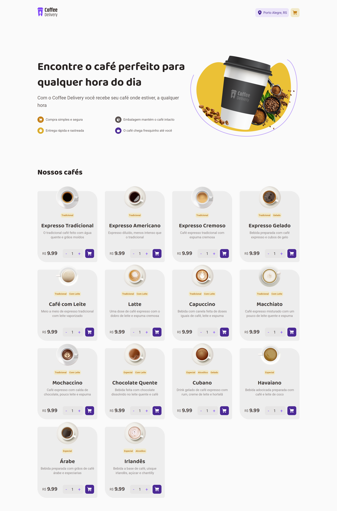

# Coffee Delivery

<!---Esses são exemplos. Veja https://shields.io para outras pessoas ou para personalizar este conjunto de escudos. Você pode querer incluir dependências, status do projeto e informações de licença aqui--->


<a href="https://coffee-delivery-sid.netlify.app/" target="_blank">Demo</a>


<br /> 
 
## 💻 Sobre

Este projeto é uma aplicação web de delivery de cafeteria, com uma ampla variedade de cafés para escolher. Ele foi construído como parte de um curso Ignite, usando as tecnologias React e Vite. Com uma interface fácil de usar, os usuários podem navegar através de uma seleção de cafés, personalizar suas ordens e fazer pedidos para entrega ou retirada. A aplicação não inclui recursos de armazenamento de histórico de pedidos, mas foi desenvolvida para proporcionar uma experiência de compra de café conveniente e personalizada para os usuários.

<br />

## 🖱 Pré-requisitos

Antes de começar, verifique se você atendeu aos seguintes requisitos:

- Você instalou a versão mais recente de `node / npm / yarn`
  <br />

## ☕ Usando o Coffee Delivery

Para usar o Coffee Delivery, siga estas etapas:

```
git clone https://github.com/SidneyRoberto9/coffee-delivery

yarn ou npm i

yarn start ou npm start
```
